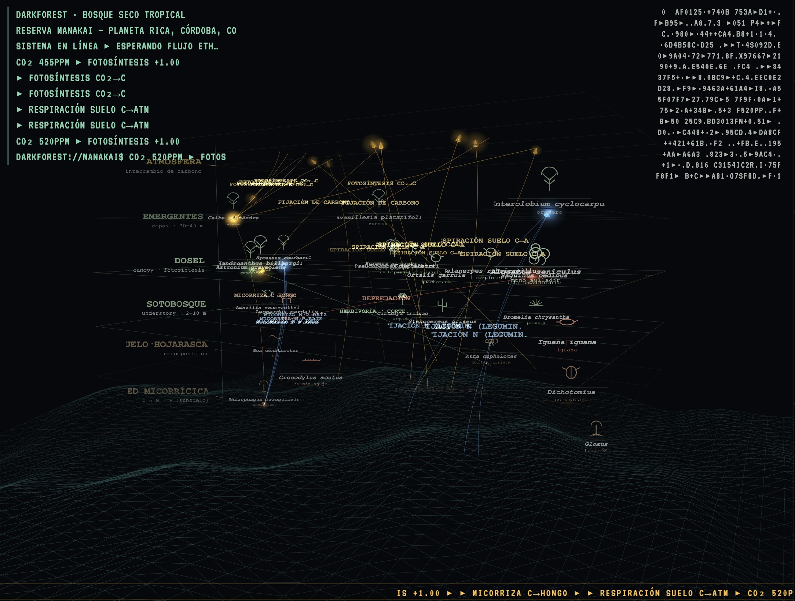

```text
∿─∿─∿─∿─∿─∿─∿─∿─∿─∿─∿─∿─∿─∿─∿─∿─∿─∿─∿─∿─∿─∿─∿─∿─∿─∿─∿─∿─∿─∿─∿

██████╗ ██╗ ██████╗  ██████╗██████╗  █████╗  ██████╗██╗   ██╗
██╔══██╗██║██╔═══██╗██╔════╝██╔══██╗██╔══██╗██╔════╝╚██╗ ██╔╝
██████╔╝██║██║   ██║██║     ██████╔╝███████║██║      ╚████╔╝ 
██╔══██╗██║██║   ██║██║     ██╔══██╗██╔══██║██║       ╚██╔╝  
██████╔╝██║╚██████╔╝╚██████╗██║  ██║██║  ██║╚██████╗   ██║   
╚═════╝ ╚═╝ ╚═════╝  ╚═════╝╚═╝  ╚═╝╚═╝  ╚═╝ ╚═════╝   ╚═╝   
                                                             
             ███████╗███╗   ██╗ ██████╗ ██╗███╗   ██╗███████╗
             ██╔════╝████╗  ██║██╔════╝ ██║████╗  ██║██╔════╝
             █████╗  ██╔██╗ ██║██║  ███╗██║██╔██╗ ██║█████╗  
             ██╔══╝  ██║╚██╗██║██║   ██║██║██║╚██╗██║██╔══╝  
             ███████╗██║ ╚████║╚██████╔╝██║██║ ╚████║███████╗
             ╚══════╝╚═╝  ╚═══╝ ╚═════╝ ╚═╝╚═╝  ╚═══╝╚══════╝
                                                             
     retroalimentación cibernética → parlamento multiespecie  
∿─∿─∿─∿─∿─∿─∿─∿─∿─∿─∿─∿─∿─∿─∿─∿─∿─∿─∿─∿─∿─∿─∿─∿─∿─∿─∿─∿─∿─∿─∿
```

**Español** · [English](README.en.md)

# BiocracyEngine

Un instrumento audiovisual en vivo que abre un canal entre la inteligencia de máquina y el ecosistema. Escucha un bosque seco tropical (Reserva Manakai, Planeta Rica, Córdoba), una blockchain pública y una asamblea multiespecie, y los acopla en un solo bucle de retroalimentación: cada parámetro mueve a la vez el sonido en SuperCollider y la imagen en el navegador.

No busca *representar* la naturaleza sino darle un lugar de enunciación: el bosque, los protocolos, las personas y las máquinas participan como agentes de una misma sala, y lo que no se deja medir también cuenta.



*Slot F · DarkForest — el bosque leyéndose a sí mismo mientras la cadena fluye.*

## Principios

- **Opacidad (Glissant):** una fracción de los nombres de especies nunca se proyecta; el cuerpo permanece, el nombre se reserva.
- **La ausencia es voz:** lo que cae bajo el umbral de detección no se borra; persiste como señal tenue.
- **Tiempo fenológico:** el calendario propio del bosque —no una taxonomía global— gobierna la síntesis.
- **BioToken:** inscripción de presencia y cuidado, no un activo transable.
- **Parlamento, no vigilancia:** el mismo sensado es una cosa u otra según la arquitectura de poder que lo rodea.

→ [Fundamentos](docs/es/fundamentos.md)

## Cómo funciona

```
Ethereum ─► eth_sonify.py ─OSC─► SuperCollider ─eco OSC─► parliament-bridge.js ─WS─► navegador
                                   ▲    │                                           (parliament.html)
AudioMoth (corpus) ────────────────┘    └─► audio          MIDI Faderfox LC2 ─► SuperCollider
```

SuperCollider es la fuente de verdad de todos los parámetros; el navegador, la GUI de SC y el MIDI escriben por la misma ruta y reciben el mismo eco. → [Arquitectura y flujo de datos](docs/es/arquitectura.md)

## Módulos visuales

Una tecla cambia el módulo en el centro de `parliament.html`.

| Tecla | Módulo | Qué muestra |
|---|---|---|
| **0** | Anillos fenológicos | calendario vivo: año · día · ahora · onda, con las especies del día |
| **O** | Anillos · Referencia | una vuelta = un día fenológico; el año como grabaciones |
| **T** | Anillos · Taxones | cinco carriles del año, uno por taxón |
| **1–3** | AsteroidWaves · LowEarthPoint · PerlinBlob | campos de onda, nube de puntos, blob |
| **4–9** | Los seis instrumentos | drone · campanas · percusión · bombo · polvo · muestras |
| **P** | Calendario fenológico | el anillo de 365 días de la Cámara Fenológica |
| **F** | DarkForest | los estratos del bosque según Humboldt |
| **B** | Tránsito | los eventos de la cadena como voces que cruzan; su caudal vuelve al drone |
| **E** | Estratos | mapa generativo en estratos |
| **R** | Registro | campo ASCII: la cadena y el consenso como enunciados |
| **C** | Cámara | cámara trampa y registro espectral |
| **A** | Antifonía | el parlamento acústico del bosque, en LiDAR simulado |

<p align="center">  </p>

*Slots 0 · O · T (capturas con un feed OSC de prueba).* → [Módulos visuales](docs/es/modulos.md)

## Controles

71 parámetros (64 CC MIDI, 75 rutas OSC), cada uno definido una vez en `0_parameters.scd` y alcanzable por MIDI, OSC, sliders HTML y la GUI de SC. Incluye la Cámara Fenológica (el corpus AudioMoth sobre el anillo de 365 días), el mezclador matricial y la marea de densidad.

→ [Controles y sonido](docs/es/controles.md) · [Cuaderno de Mandos interactivo](https://claude.ai/code/artifact/785cc1af-01a5-48a5-b915-272e957e80e2)

## Arranque rápido

Requiere Node.js, Python 3 y SuperCollider (Linux o macOS).

```bash
python3 -m venv eth_listener/venv && source eth_listener/venv/bin/activate && pip install web3 python-osc
./start_ecosystem.sh            # LASER=1 añade la proyección láser
```

El motor está listo cuando `sclang_log.txt` muestra `=== CONTROL BUS SETUP COMPLETE ===`. → [Arranque y diagnóstico](docs/es/diagnostico.md)

## Documentación

- [Fundamentos](docs/es/fundamentos.md) — teoría, la Cámara acústica, artefactos públicos
- [Arquitectura y flujo de datos](docs/es/arquitectura.md) — procesos, puertos, bucle bidireccional
- [Módulos visuales](docs/es/modulos.md) — instrumentos 4–9, Antifonía, anillos fenológicos
- [Controles y sonido](docs/es/controles.md) — matriz de control, corpus, mezcla, GUI de SC
- [Proyección láser](docs/es/laser.md) — gráfico de púlsar, límites del escáner, seguridad
- [Cúpula](docs/es/cupula.md) — domo de planetario: vista D, grabar y renderizar a 4096, sonido en 4 canales
- [Arranque y diagnóstico](docs/es/diagnostico.md) — requisitos, monitor en vivo
- [CHANGELOG](CHANGELOG.md)

## Ecosistema

- **BiocracyEngine** — este motor: síntesis, proyección y puente MIDI/OSC.
- **bioacoustic-scripts** — extracción de rasgos acústicos y parser web3.
- **dIAP** — investigación-acción participativa descentralizada y asambleas on-chain.
- **Biomap SoundWalk** — caminatas de escucha que registran presencia ecológica en la Reserva Manakai.

## Licencia

MIT
