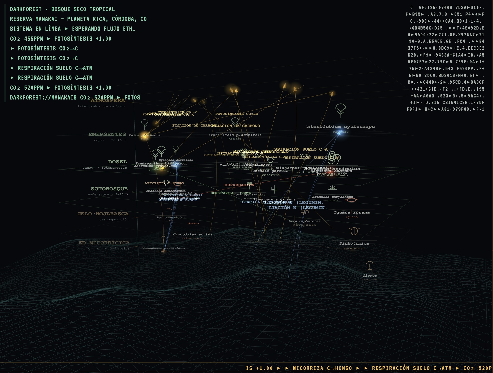

[Leer en Español / Read in Spanish](README.md)

```text
∿─∿─∿─∿─∿─∿─∿─∿─∿─∿─∿─∿─∿─∿─∿─∿─∿─∿─∿─∿─∿─∿─∿─∿─∿─∿─∿─∿─∿─∿─∿

██████╗ ██╗ ██████╗  ██████╗██████╗  █████╗  ██████╗██╗   ██╗
██╔══██╗██║██╔═══██╗██╔════╝██╔══██╗██╔══██╗██╔════╝╚██╗ ██╔╝
██████╔╝██║██║   ██║██║     ██████╔╝███████║██║      ╚████╔╝ 
██╔══██╗██║██║   ██║██║     ██╔══██╗██╔══██║██║       ╚██╔╝  
██████╔╝██║╚██████╔╝╚██████╗██║  ██║██║  ██║╚██████╗   ██║   
╚═════╝ ╚═╝ ╚═════╝  ╚═════╝╚═╝  ╚═╝╚═╝  ╚═╝ ╚═════╝   ╚═╝   
                                                             
             ███████╗███╗   ██╗ ██████╗ ██╗███╗   ██╗███████╗
             ██╔════╝████╗  ██║██╔════╝ ██║████╗  ██║██╔════╝
             █████╗  ██╔██╗ ██║██║  ███╗██║██╔██╗ ██║█████╗  
             ██╔══╝  ██║╚██╗██║██║   ██║██║██║╚██╗██║██╔══╝  
             ███████╗██║ ╚████║╚██████╔╝██║██║ ╚████║███████╗
             ╚══════╝╚═╝  ╚═══╝ ╚═════╝ ╚═╝╚═╝  ╚═══╝╚══════╝

        cybernetic feedback → multispecies parliament        
∿─∿─∿─∿─∿─∿─∿─∿─∿─∿─∿─∿─∿─∿─∿─∿─∿─∿─∿─∿─∿─∿─∿─∿─∿─∿─∿─∿─∿─∿─∿
```

# BiocracyEngine
### Cybernetic Feedback & Multispecies Governance as Practice-Based Research

**BiocracyEngine** is a live audiovisual research-creation instrument and deployable public artifact developed within a PhD framework spanning Arts, Design, Science, and Bioacoustics. The engine couples three distinct registers into a single, closed feedback loop:
1. **Financial/Protocol Register:** Public blockchain state (Ethereum web3 data).
2. **Political/Deliberative Register:** A multispecies parliament representing non-human agency.
3. **Ecological/Bioacoustic Register:** The phenological calendar and acoustic recordings of a tropical dry forest (Reserva Manakai, Córdoba, Colombia).

Rather than treating data as passive material for visualization, the engine implements a **cybernetic feedback loop** where code acts as an active theoretical argument. Software parameters, digital signal processing (DSP) algorithms, spatialization topologies, and hardware controllers operate as executable political and ecological rules.


*Figure 1: Slot F · DarkForest — The tropical dry forest of Reserva Manakai as a live stratigraphic data-scape. Humboldtian strata from atmosphere down through canopy, understory, and leaf litter to the mycorrhizal network, integrated with the incoming Ethereum stream.*

---

## 1. Theoretical Framework & Research-Creation Contributions

The core contribution of this work lies in **transmuting critical theoretical concepts into technical constraints within running software**. The instrument functions as a buildable, operational critique of extractive "Nature Fintech" and financialized "Ecological State Protocols."

```
                 ┌──────────────────────────────────────┐
                 │       Public Blockchain (ETH)        │
                 └──────────────────┬───────────────────┘
                                    │ Transactions / Gas
                                    ▼
┌───────────────────────────────────┴───────────────────────────────────┐
│                          CYBERNETIC LOOP                              │
│                                                                       │
│  ┌───────────────────────┐                 ┌───────────────────────┐  │
│  │ Bioacoustic Sensor    │◄────────────────┤ Decolonial IAP &      │  │
│  │ (AudioMoth 365 Ring)  │                 │ Community Sovereignty │  │
│  └───────────┬───────────┘                 └───────────────────────┘  │
│              │ Ecology                                 ▲              │
│              ▼                                         │ Representation
│  ┌───────────────────────┐                 ┌───────────┴───────────┐  │
│  │ SuperCollider DSP     │────────────────►│ Multispecies          │  │
│  │ (4-Ch Quad/Sub-Bass)  │ Sound Mass      │ Parliament Assembly   │  │
│  └───────────────────────┘                 └───────────────────────┘  │
└───────────────────────────────────────────────────────────────────────┘
```

### Glissant's Right to Opacity as Software Constraint
Édouard Glissant asserts that subaltern subjects have a fundamental right to remain opaque and unconsumed by Western epistemologies. In `BiocracyEngine`, this is compiled directly into the software state as `opacityFloor` ([0_parameters.scd](file:///Users/a/Documents/code/BiocracyEngine/0_parameters.scd#L85)):
* A deterministic fraction of active species labels is withheld from visual projection and vector laser rendering.
* The opacity clause is explicitly declared **untranslatable to sound**: withholding information from the visual gaze does not mute or alter the SuperCollider synthesis.
* Non-human entities persist in physical sound mass while refusing total visual surveillance.

### Agamben’s Coming Community & Singularities
Following Giorgio Agamben, the multispecies parliament seats species as *singularities*, never as economic identities or ecosystem service assets:
* Species from the 572-inventory of Reserva Manakai are admitted based on their sheer presence rather than monetary valuation or IUCN Red List rarity ranks.
* The assembly seats in [5_beat_engine.scd](file:///Users/a/Documents/code/BiocracyEngine/5_beat_engine.scd#L223) map ecological roles to frequency registers, guaranteeing representation independent of human utility.

### Decolonial Acoustemology & Sound Mass (Feld, English, Oliveros)
Rooted in Steven Feld’s *Acoustemology* (acoustic epistemology), the soundscape is treated as a primary mode of ecological knowing:
* **Lawrence English & Physical Sound Mass:** Sound is experienced as air pressure and tactile mass. High sub-bass density (`droneDepth`, `mixDrone`) provides a physical floor beneath field recordings.
* **Pauline Oliveros & Deep Listening:** Spatialization across a 4-channel quadraphonic field creates an expanded, 365-degree listening environment where global ambient attention and focal listening coexist.
* **Absence is Voice:** Unrecorded phenological days or species falling below sensory detection thresholds are not zeroed out. Under Article 44, they sound as a high-frequency ultrasonic layer (×8 time-expanded AudioMoth recordings), asserting that what is unmeasured still participates.

### Non-Financialized BioTokens & Decolonial IAP
The project incorporates Investigación-Acción Participativa (IAP, Orlando Fals Borda) to disintermediate extractive NGO circuits:
* **BioToken:** Formulated as a non-tradable unit of political inscription and deep listening, inverting the speculative logic of carbon offsets.
* Data sovereignty remains centered in the local territorial community (El Balzal, Córdoba, Colombia).

---

## 2. Technical Architecture & System Infrastructure

```
ETH Blockchain
     │
     ▼
eth_sonify.py (Web3 Python Scraper)
     │  OSC → UDP:57120
     ▼
SuperCollider (Audio & Synthesis Engine)
  ├─ 1_server_config.scd      MOTU 828x 4-Channel / CoreAudio Auto-Detect
  ├─ 2_midi_control.scd       Faderfox LC2 Table-Driven MIDI Handler (CC 0–49)
  ├─ 3_synthdefs.scd          DSP SynthDefs & Cross-Layer Modulation
  ├─ 4_gui.scd                SC 1-Bit Monospace GUI & Matrix Mixer
  ├─ 5_beat_engine.scd        Evolving Beat Engine & Species Registers
  ├─ 6_osc_handlers.scd       OSC Control Routes → ~buses
  ├─ 10_sample_system.scd     Paulstretch Sample Playback
  ├─ 12_spatial_gui.scd        2D Interactive Quadraphonic Radar GUI
  ├─ 14_phenological_corpus.scd AudioMoth 365-Day Phenological Ring
  └─ Audio Output ────────────► MOTU 828x (4-Ch Quad) ➔ 4× KRK Rokit 5
     │
     │  OSC Echo → UDP:3333 (~visualsDest)
     ▼
parliament-bridge.js (Node.js OSC ↔ WebSocket)
  │  UDP:3333 ← SC/MIDI Echo | WS:3334 ↔ WebGL Browser | HTTP:3335 /diag
  ▼
nw_wrld Electron Browser (parliament.html)
  ├─ HTML Sliders (34 Param Controls)
  ├─ 16 Visual Slots (Three.js / p5.js / Pretext ASCII)
  └─ Laser Tap ──WS:3337──► laser-bridge.js ──USB──► Helios DAC ──► ILDA Laser
```

### Multichannel Audio & Quadraphonic Spatialization
The audio engine natively supports 4-channel quadraphonic spatialization for a MOTU 828x interface and 4 KRK Rokit 5 studio monitors:
* **Automatic Hardware Detection:** [1_server_config.scd](file:///Users/a/Documents/code/BiocracyEngine/1_server_config.scd#L15-L34) scans output devices. When a MOTU 828x or Gen5 interface is detected, SuperCollider configures `numOutputBusChannels = 4`.
* **Quadraphonic DSP (`PanAz.ar`):** Every synth def in [3_synthdefs.scd](file:///Users/a/Documents/code/BiocracyEngine/3_synthdefs.scd#L462) uses `PanAz.ar(4, sig, ...)` when 4 channels are enabled:
  * **Channel 0 (Line Out 1):** Front Left (FL) ➔ Rokit 5 #1
  * **Channel 1 (Line Out 2):** Front Right (FR) ➔ Rokit 5 #2
  * **Channel 2 (Line Out 3):** Rear Right (RR) ➔ Rokit 5 #3
  * **Channel 3 (Line Out 4):** Rear Left (RL) ➔ Rokit 5 #4
* **Master 4-Channel Glue Compressor & Limiter:** The `masterLimiter` process operates across all 4 channels simultaneously, protecting headroom while maintaining spatial separation.
* **Spatial Control GUI:** [12_spatial_gui.scd](file:///Users/a/Documents/code/BiocracyEngine/12_spatial_gui.scd) provides a 2D interactive radar window to position and move sound sources in real time.

---

## 3. Canonical Parameter Control Matrix

All parameters are centrally registered in [0_parameters.scd](file:///Users/a/Documents/code/BiocracyEngine/0_parameters.scd#L31-L170). The table below details the unified control matrix binding MIDI CCs (Faderfox LC2), OSC routes, SuperCollider DSP ranges, and visual slot reactions.

| Parameter | MIDI CC | OSC Address | SC DSP Range | Visual / Theoretical Function |
| :--- | :---: | :--- | :--- | :--- |
| **masterVolume** | `CC 0` | `/soneth/volume` | `0.01 .. 1.0` (lin) | Master output amplitude |
| **pitchShift** | `CC 1` | `/soneth/pitchshift` | `-24 .. +24` (st) | Global pitch transposition |
| **timeDilation** | `CC 2` | `/soneth/timedilation` | `0.5 .. 6.0` (exp) | Time-stretch factor & envelope length |
| **spectralShift** | `CC 3` | `/soneth/spectralshift` | `80 .. 2400` Hz (exp) | Global low-pass filter cutoff |
| **spatialSpread** | `CC 4` | `/soneth/spatialspread` | `-1.0 .. +1.0` (lin) | Quadraphonic azimuth & stereo panning |
| **masterAmp** | `CC 5` | `/soneth/masteramp` | `0.0 .. 1.0` (lin) | Master layer trim multiplier |
| **filterCutoff** | `CC 6` | `/soneth/filtercutoff` | `0.0 .. 1.0` (lin) | Relative timbre tilt filter |
| **noiseLevel** | `CC 7` | `/soneth/noiselevel` | `0.0 .. 0.5` (lin) | Exciter noise breath level |
| **noiseFilt** | `CC 8` | `/soneth/noisefilt` | `0.0 .. 1.0` (lin) | Exciter noise filter cutoff |
| **droneDepth** | `CC 9` | `/soneth/dronedepth` | `0.0 .. 1.0` (lin) | Sub-bass fundamental weight |
| **activityThreshold**| `CC 10`| `/pheno/activityThreshold`|`0.20 .. 0.85` (lin)| Art. 45 — Species presence threshold |
| **windowWidth** | `CC 11`| `/pheno/windowWidth` | `0.4 .. 2.5` (lin) | Art. 43 — Gaussian reach in ring days |
| **seasonalBias** | `CC 12`| `/pheno/seasonalBias` | `-1.0 .. +1.0` (lin) | Dry season (-1) ↔ Rainy season (+1) |
| **absenceWeight** | `CC 13`| `/pheno/absenceWeight` | `0.0 .. 1.0` (lin) | Art. 44 — Ultrasonic absence layer volume |
| **pulseGain** | `CC 14`| `/pheno/pulseGain` | `0.0 .. 2.0` (lin) | Art. 45 — Quórum sensible feedback gain |
| **opacityFloor** | `CC 15`| `/pheno/opacityFloor` | `0.0 .. 0.7` (lin) | Art. 47 — Glissant opacity floor |
| **bancada** | `CC 16`| `/pheno/bancada` | `0 .. 4` (integer) | Art. 43 — Ecological role bench filter |
| **tideShort** | `CC 17`| `/tide/short` | `0 / 1` (toggle) | Short tidal rhythm arc (~40s) |
| **tideMedia** | `CC 18`| `/tide/media` | `0 / 1` (toggle) | Medium tidal rhythm arc (~1.5–2m) |
| **tideLarga** | `CC 19`| `/tide/larga` | `0 / 1` (toggle) | Long tidal rhythm arc (~4–6m) |
| **tidePulse** | `CC 20`| `/tide/pulse` | `0 / 1` (toggle) | Sub-bass heartbeat pulse |
| **phenoRate** | `CC 21`| `/pheno/rate` | `0.002 .. 4.0` (exp)| Phenological ring speed (days/sec) |
| **corpusLevel** | `CC 22`| `/pheno/corpusLevel` | `0.0 .. 1.0` (lin) | AudioMoth corpus layer balance |
| **chainProcess** | `CC 23`| `/chain/process` | `0.0 .. 1.0` (lin) | ETH blockchain coupling factor |
| **textureDepth** | `CC 32`| `/soneth/texturedepth` | `0.0 .. 0.6` (lin) | FM index & granular texture depth |
| **atmosphereMix** | `CC 33`| `/soneth/atmospheremix`| `0.0 .. 0.9` (lin) | Reverb mix & space diffusion |
| **memoryFeed** | `CC 34`| `/soneth/memoryfeed` | `0.0 .. 0.8` (lin) | Delay feedback / memory send |
| **harmonicRich** | `CC 35`| `/soneth/harmonicrich` | `0.1 .. 5.0` (exp) | Harmonic partial count & FM ratio |
| **resonantBody** | `CC 36`| `/soneth/resonantbody` | `0.1 .. 0.8` (lin) | Resonator Q & inharmonicity |
| **droneFade** | `CC 37`| `/soneth/dronefade` | `0.1 .. 5.0` s (exp)| Drone portamento & smoothing time |
| **droneSpace** | `CC 38`| `/soneth/dronespace` | `0.0 .. 1.0` (lin) | Drone reverb room size |
| **droneMix** | `CC 39`| `/soneth/dronemix` | `0.0 .. 1.0` (lin) | Drone dry ↔ bloomed mix |
| **delayFeedback** | `CC 40`| `/soneth/delayfeedback`| `0.0 .. 0.95` (lin)| Comb delay feedback amount |
| **transactionInfluence**|`CC 41`|`/soneth/txInfluence` | `0.0 .. 1.0` (lin) | Blockchain transaction modulation depth |
| **mixDrone** | `CC 42`| `/mix/drone` | `0.0 .. 2.0` (lin) | Matrix Mixer: `\opalDrone` layer level |
| **mixPad** | `CC 43`| `/mix/pad` | `0.0 .. 2.0` (lin) | Matrix Mixer: `\elektronBell` layer level |
| **mixKick** | `CC 44`| `/mix/kick` | `0.0 .. 2.0` (lin) | Matrix Mixer: `\opalKick` layer level |
| **mixPerc** | `CC 45`| `/mix/perc` | `0.0 .. 2.0` (lin) | Matrix Mixer: `\opalPerc` layer level |
| **mixDust** | `CC 46`| `/mix/dust` | `0.0 .. 2.0` (lin) | Matrix Mixer: `\opalDust` layer level |
| **mixSample** | `CC 47`| `/mix/sample` | `0.0 .. 2.0` (lin) | Matrix Mixer: `\samplePlayer` layer level |
| **mixCorpus** | `CC 48`| `/mix/corpus` | `0.0 .. 2.0` (lin) | Matrix Mixer: `\corpusVoice` layer level |
| **mixUltra** | `CC 49`| `/mix/ultra` | `0.0 .. 2.0` (lin) | Matrix Mixer: `\corpusUltrasonic` level |

> For complete hardware setup, standalone MIDI mapping, and Ableton Live routing guide, see [FADERFOX_LC2_MIDI_MAP.md](file:///Users/a/Documents/code/BiocracyEngine/FADERFOX_LC2_MIDI_MAP.md).

---

## 4. Soundscape Modalities & Cross-Layer DSP Modulation

`BiocracyEngine` includes three curated soundscape presets stored in `presets/` and selectable from the SC GUI dropdown menu or via OSC:

1. **`1_LawrenceEnglish_Presion`** ([presets/1_LawrenceEnglish_Presion.json](file:///Users/a/Documents/code/BiocracyEngine/presets/1_LawrenceEnglish_Presion.json)): Focuses on sound mass, physical sub-bass air pressure (`droneDepth: 0.85`, `mixDrone: 2.0`), deep time stretch (`timeStretch: 4.5`), heavy room reverb (`atmosphereMix: 0.85`), dark comb-delay crackle (`delayFeedback: 0.65`), and muted kick (`mixKick: 0.0`).
2. **`2_DeepListening_Espacial`** ([presets/2_DeepListening_Espacial.json](file:///Users/a/Documents/code/BiocracyEngine/presets/2_DeepListening_Espacial.json)): Focuses on Pauline Oliveros’s expanded listening practice. Features wide 3D quadraphonic spread (`spatialSpread: 0.85`), organic dust micro-grains (`mixDust: 1.3`), and crystalline pad shimmers.
3. **`3_Acustemologia_BosqueSeco`** ([presets/3_Acustemologia_BosqueSeco.json](file:///Users/a/Documents/code/BiocracyEngine/presets/3_Acustemologia_BosqueSeco.json)): Tropical dry forest acoustemology. Prioritizes dominant field recordings (`mixSample: 2.0`, `mixCorpus: 1.5`), leaf litter & insect crackle (`mixDust: 1.4`, `noiseFilt: 0.7`), and bio-acoustic spectral tilt (`spectralShift: 1800 Hz`).

### Cross-Layer Acoustic Modulation (DSP Code)
Rather than operating as isolated synthesis channels, the audio layers in [3_synthdefs.scd](file:///Users/a/Documents/code/BiocracyEngine/3_synthdefs.scd#L590-L635) dynamically modulate each other:
```supercollider
// In SynthDef(\opalPerc):
// Dust opens the exciter noise breath (nLevel), making attacks torn and bowed
nLevel = (nLevel + (dustMod * 0.20)).clip(0, 1);

// Pad presence opens filter cutoff, harmonizing upper resonances with blooming chords
cutoff = (cutoff + (padMod * 0.25)).clip(0, 1);

// Kick presence tightens inharmonicity for punchier body resonance
res    = (res + (kickMod * 0.15)).clip(0.1, 0.95);

// Field recording presence (mixSampleBus) extends comb-delay feedback, weaving perc into field recordings
dFeed  = (dFeed + (sampleMod * 0.20)).clip(0, 0.9);
```

---

## 5. Vector Laser Projection (ILDA / Helios DAC)

The system projects vector geometry onto physical forest canopies via an ILDA laser and Helios DAC (`LASER=1 ./start_ecosystem.sh`):

```
browser laserTap ──WS:3337──► laser-bridge.js ──USB──► Helios DAC ──► ILDA Laser
```

### Galvo Path Safety & Opacity Enforcement
* **Galvo Safety Scanner Envelope:** Scanner step limits are derived from physical velocity ceilings (`Scan Speed 30 kpps @ 8°`). Auto-blanking disables the beam if angular velocity or scan budgets exceed mechanical safety limits.
* **Pulsar Plotting:** Draws stacked spectral ridgelines (*Unknown Pleasures* geometry) via serpentine scanning and arc-length sampling.
* **Opacity Clause in Physical Space:** Species withheld by the Glissant opacity clause (`opacityFloor`) or marked sensitive contribute **zero vector paths** to the laser output. The vulnerable non-human entity is never physically projected or exposed.

---

## 6. Quick Start & Diagnostics

### Launch Full Ecosystem
```bash
./start_ecosystem.sh
```
Starts all services: Node parliament-bridge, SuperCollider audio engine, Python Web3 scraper, and Electron browser interface.

### Diagnostic Sweep Test
```bash
cd nw_wrld_local && node diag-sweep.js
```
Runs a diagnostic sweep across all 34 parameters (0 ➔ 1 ➔ 0.5) and verifies bidirectional OSC/WebSocket connectivity.

### Live Engine Log Monitor
Monitor live synth counts, limiter gain reduction, and incoming Web3 transaction blocks:
```bash
tail -f sclang_log.txt | grep MON
```

---

## License

MIT License — Developed as practice-based research-creation for open territorial and bioacoustic inquiry.
