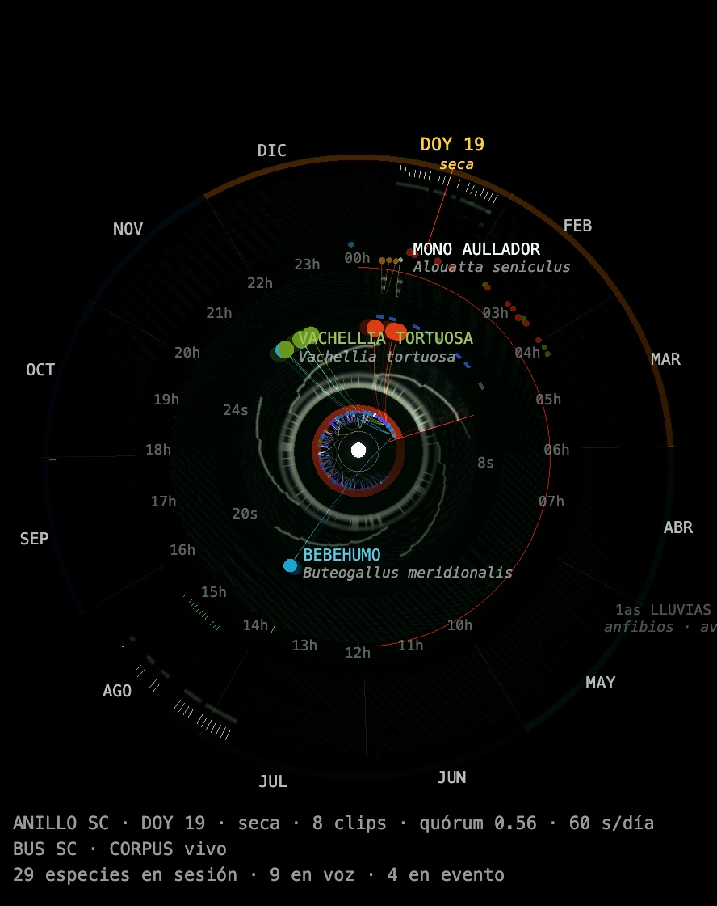
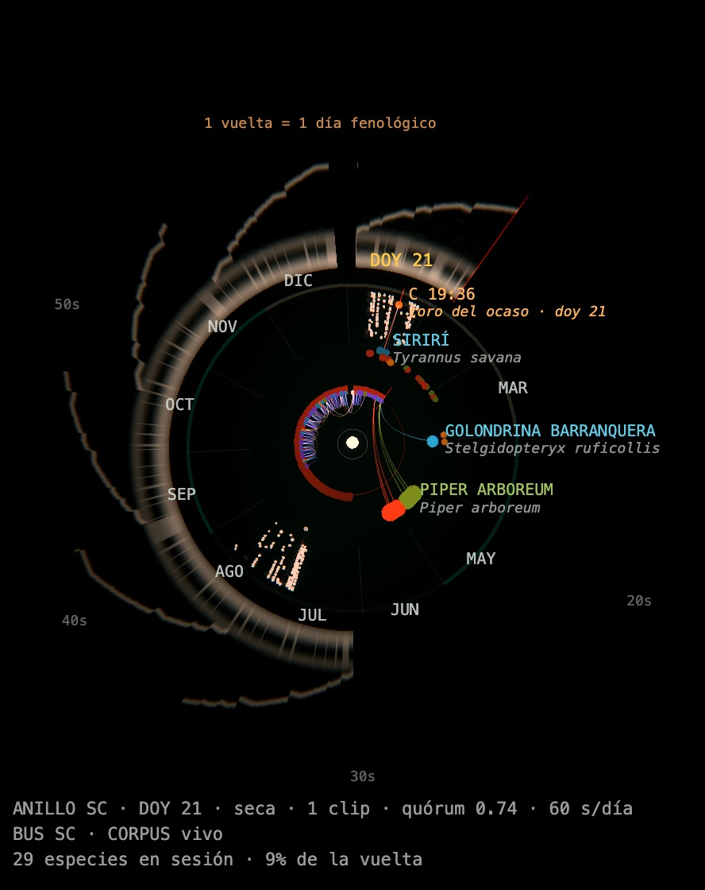
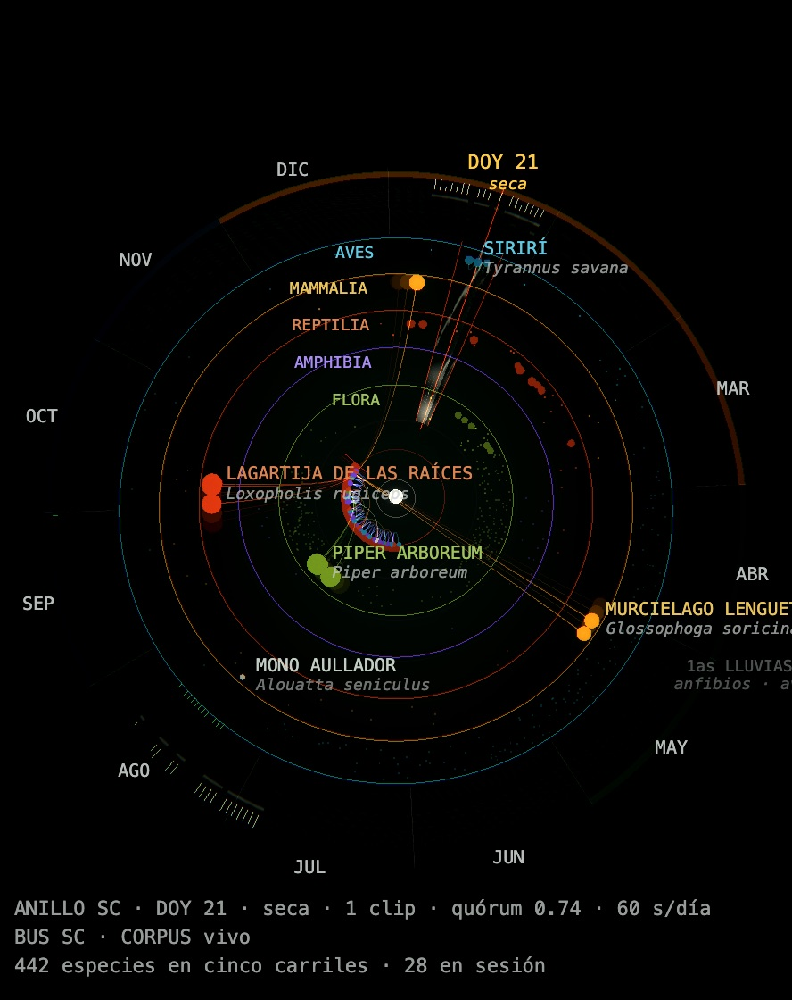

← [README](../../README.md) · [English](../en/modules.md)

# Módulos visuales

## El Motor Biocrático · seis órganos

Los diecinueve módulos son órganos de un mismo motor, no visualizaciones sueltas. El motor tiene dos espacios de entrada: **el bosque** (corpus AudioMoth, fenología, especies) y **la cadena** (Ethereum en vivo). Los dos mueven un solo motor sonoro. Cada órgano procesa esa entrada a su manera, y cada módulo es una vista de su órgano. Un mando nunca pertenece a un módulo: pertenece al motor, y cada módulo lo lee a su modo. El [Cuaderno de Mandos](https://claude.ai/code/artifact/785cc1af-01a5-48a5-b915-272e957e80e2) muestra, para cada módulo, qué mandos lo alcanzan.

| Órgano | Módulos | Qué hace en el parlamento |
|---|---|---|
| **I · El Hemiciclo** | 0 · O · T | Quién tiene escaño, y cuándo: los relojes del año, el día, el ahora y el golpe. Los tres comparten `rings/RingStageBase.ts`, así que los mismos mandos los alcanzan igual |
| **II · La Cámara Fenológica** | P · C · 1 | El año como evidencia (Arts. 42, 43, 47): el calendario y sus bancadas, lo que vio la cámara trampa, la cordillera que deja el sonido |
| **III · Los Estratos** | F · E · A | El bosque por alturas (Humboldt): quien canta, canta desde una altura |
| **IV · Las Seis Voces** | 4–9 | El motor que suena, una voz por módulo, con el espacio de mezcla bosque ↔ cadena adentro |
| **V · La Deliberación** | B · R | De la señal al acta: lo inscrito y la profundidad del acta vuelven al sonido |
| **VI · La Antesala** | 2 · 3 | Bocetos y pruebas, sin bancada propia |

### En la cúpula

Medido módulo por módulo sobre el domemaster (octubre 2026):

| Cómo llega | Módulos | Por qué |
|---|---|---|
| **envuelve** | 1, 4–9, A | 4–9 llevan capas pensadas para el domo: fórmulas en vuelo, constelación en el cielo, anillos de texto. 1 se curva alrededor del público. A rodea con su rodal |
| **compacto** | 0, O, T, P, F, 2 | Un mundo visto de frente: ocupa una parte del domo. Los anillos son un disco plano visto desde lejos |
| **fondo** | B, R, E | Llenan con su color de fondo, no con contenido. B y R son blancos y lavan el contraste del domo |
| **panel 2D** | 3, C | No son escenas 3D: un plano al frente, que no puede envolver |

Dos de ellos fallaban y ya no:
- **A no aparecía.** Antifonía estaciona lo que no usa a y = −9999 en lugar de borrarlo. La inmersión de la cúpula apuntaba al centro de *toda* la escena y sacaba la cámara del bosque. Ahora apunta al centro de lo que ve la cámara del módulo (`domemaster.ts`, `sceneCentre`).
- **C salía negro.** El CRT es un canvas WebGL que se borraba tras mostrarse; ahora conserva su imagen (`camara/crt.ts`, `preserveDrawingBuffer`).

## Módulos 4–9 · los seis instrumentos

Los seis slots de estructuras de datos eran diagramas planos sobre cámaras ortográficas que leían *valores* de control y nunca el sonido. Ahora son las **seis voces del motor, una cada uno y sin repetir** — el instrumento desplegado en seis pantallas:

| Slot | Instrumento | Voz en SC | Registro |
|---|---|---|---|
| 4 | **DRONE** | `\opalDrone` | la cama sostenida |
| 5 | **CAMPANAS** | `\elektronBell` | pads |
| 6 | **PERCUSIÓN** | `\opalPerc` | pulso |
| 7 | **BOMBO** | `\opalKick` | sub |
| 8 | **POLVO** | `\opalDust` | granular |
| 9 | **MUESTRAS** | `samplePlayer*` | grabaciones de campo |

Cada uno tiene una cámara en perspectiva que se puede orbitar, profundidad real en su geometría (las trazas del drone se alejan con la edad, la retícula de campanas respira en Z, el árbol se sostiene por capas, el bombo se irradia como frente de presión, la caché es una pila por la que se podría caminar, la tabla hash es un anillo) y la misma deriva en reposo que el resto de slots.

El nombre del instrumento solía **dibujarse dentro de la escena** como un sprite flotando sobre cada uno. Eso se eliminó: era un rótulo sobre una superficie de proyección, el único elemento en seis slots por lo demás sin palabras que se dirigía al espectador en vez de a la sala, y ocupaba el mismo tercio superior hacia el que proyecta la performance. La vinculación que anunciaba es la real y sobrevive intacta: cada slot sigue leyendo su propia banda del espectro y los onsets de su propia voz, según la tabla de arriba.

**Y ahora lo tocan.** Cada uno de los seis era un oyente: ligado a una voz, leyendo su banda y su onset, dibujando lo que oía. Ahora también *hablan*, desde sus propios eventos estructurales — la pantalla toca el instrumento:

| Slot | Voz | El evento propio de la estructura |
|---|---|---|
| 4 | DRONE | la retícula completa un barrido entero → un **parcial** sostenido se suma a la cama |
| 5 | CAMPANAS | se forma una arista — dos nodos que no estaban conectados ahora lo están |
| 6 | PERCUSIÓN | un nodo llega a su destino — un rebalanceo se ha completado de verdad |
| 7 | BOMBO | se adquiere un objetivo — un rayo cruza un barrido |
| 8 | POLVO | una capa desborda su propio nivel — bloques derramándose por el borde |
| 9 | MUESTRAS | una colisión de hash — y *cuál* bucket colisionó elige la grabación |

**Un slot toca la voz del motor, no un instrumento nuevo.** La primera versión las hacía separadas: alturas desde mapeos lineales independientes, envolventes desde literales, spawns sin agrupar. No mezclaban, y una de ellas no se movía en absoluto — `\elektronBell` limita su fundamental a 28–180 Hz (`3_synthdefs.scd:241`), así que un mapeo lineal a MIDI 48–84 cruzaba el techo en tono 0.15 y **el 85 % del rango tocaba una única altura idéntica**. Ahora:

- el **pad** se ajusta a la rejilla de semitonos y pliega octavas bajo 160 Hz igual que los pads de ETH, y se encola en `~padQueue` para que el drenaje le dé `\polyComp` — lanzarlo directo lo dejaba hasta 4.9× más fuerte que un pad concurrente del motor *y* corrompía la compensación `1/√n` del propio motor al quedar invisible para `~padLive`;
- la **percusión** toma de `~computePitchPool` × `~speciesBand`, el modo propio del motor, en vez de un barrido continuo que tocaba esas notas por coincidencia;
- el **bombo** recorre los siete pasos discretos del motor (45.5–54.5 Hz) y resuena sus 0.9–1.3 s en lugar de chasquear durante 0.28;
- todo se lanza dentro de `s.makeBundle(s.latency, …)`, como cada voz del motor.

**El slot 4 añade un parcial; no re-afina la cama.** Antes llamaba a `~opalDroneSynth.set(\freq, …)` — una segunda fuente de control sobre un nodo que el motor de beat recorre cada cuatro compases, sin arbitraje alguno (`\drone` es la única voz que el motor nunca estampa en `~lastVoiceAt`). Con un glissando de 4 segundos (`droneFade × 2`) la cama pasaba la mayor parte de su vida en tránsito y nunca llegaba. Ahora lanza su propio `\opalDrone` de amplitud baja, con tope de dos concurrentes y liberado a los nueve segundos. Una sola fuente de control para cada cosa.

**Un slot habla ante una EXCURSIÓN, no ante un cambio.** Estas cuentas fluctúan en cada cuadro — el slot 6 suma `Math.random()` a las posiciones de los nodos en la línea siguiente a contar cuáles han llegado, así que "llegado" es ruido de cuadro por construcción. Un ingenuo "¿ha subido desde la última vez?" resulta entonces verdadero siempre que se reabre la compuerta de tasa, y la compuerta deja de ser un límite para volverse el reloj: medido, el slot 6 disparaba 8 veces por segundo (una vibración) y el slot 7 a unos 83 BPM clavados (una caja de ritmos). Ninguno era la estructura hablando; ambos eran el limitador de tasa. Cada slot corre ahora un disparador Schmitt sobre una línea base lenta — la medida tiene que subir ~35 % por encima de lo que ha venido haciendo, y volver a bajar antes de poder hablar de nuevo. Medido después: 0.05–1.35 onsets/s, irregular.

**El slot no decide si la nota ocurre.** El motor de beat ya decide cuándo hablan bombo, percusión y polvo, y el manejador de ETH decide la campana; un slot decidiendo lo mismo sería una segunda autoridad sobre una sola regla, que es el fallo que este código no para de tener que deshacer — los siete toggles `/rhythm/` que se eliminaron por eso, la exclusividad de la marea impuesta en exactamente un lugar.

Así que un slot *solicita*, en `/slot/voice [voiceIdx, amp, tone]`, y `15_slot_voices.scd` decide. Tanto el motor como el planificador estampan un reloj de onset compartido, `~lastVoiceAt`, y una solicitud que cae dentro del hueco mínimo de una voz se descarta en lugar de superponerse. Un slot sólo puede hablar, por tanto, donde el motor ha dejado sitio — el pulso sigue siendo del motor, la puntuación es del slot. Medido: un emisor desbocado a 100 solicitudes por segundo queda topado en 13.7 onsets/s sobre `dust`, y un slot pidiendo un bombo inmediatamente después de que el motor disparara uno es rechazado.

Los huecos se fijan por aquello *para lo que sirve* la voz, no por gusto: `drone` 6 s (un cambio de altura es estructural), `dust` 0.07 s (granular, debe poder enjambrar), `sample` 1.6 s (son grabaciones de campo de 30 segundos, y dos por segundo es un collage). `/slot/voices/enable 0` devuelve los seis a la escucha sin desmontarlos.

> **El disparo nunca viene del audio.** Un slot disparando su propia voz desde la energía de su propia banda es un bucle de realimentación: tocaría porque está tocando. Cada emisor lo acciona la simulación, que además es todo el sentido del asunto.

**Reaccionan al sonido, no a la intención.** `\masterScope` analiza el bus maestro *después* del limitador y envía 16 bandas espaciadas logarítmicamente a 20 Hz — eso venía llegando desde siempre sin que nadie escuchara, así que el espectrograma corría sobre su reserva sintética. Ahora alimenta `window.__scAudio`, y SC además emite `/voice/*` en el momento en que empieza cada nota. La energía en una banda dice que una campana está sonando; el onset dice que fue golpeada, y sin él todo lo visual llega tarde y emborronado.

Cada slot lee **su propio registro**, normalizado contra su propio pico reciente — un visual de bombo no debe iluminarse porque sonó una campana, y medido sobre un motor en vivo la banda grave corre unas 40× más caliente que la aguda, así que una lectura cruda deja los slots de agudos con aspecto de muertos mientras trabajan.

## Módulos 4–9 · el espacio de mezcla

Cada módulo instrumento (4–9) conserva su mundo entero: estructuras, estelas, constelaciones, ticker. En la misma escena, `blend/blendLayer.ts` agrega una **mezcla conceptual** (Fauconnier y Turner) de los dos espacios de entrada del motor: *neuronal · bosque* (la capa CORPUS, las especies) y *silicio · cadena* (Ethereum mainnet). Como vive en la escena del módulo, la cúpula, el NDI y el render 4K la llevan, con el brillo y las estelas propios del módulo.

- **Fórmulas en vuelo.** Una oleada del bosque escribe en el aire la ley neuronal del módulo, que entra volando por un lado. Un bloque de la cadena manda la ley de silicio por el otro. Cada una lleva un número en vivo. Cuando las dos llegan al frente **se transforman una en otra** (TransformMatchingParts de manim) y se vuelven la mezcla, o la estructura genérica que comparten; sube y se disuelve. Una fórmula que no encuentra a nadie sigue de largo y se desescribe.
- **La superficie de mezcla.** Una malla bajo la estructura cuya forma es la mezcla: `h = (1−λ)·membrana + λ·retícula`. La membrana son oleadas suaves en las especies, que respiran con el bosque. La retícula son terrazas que levantan las transacciones, la forma escalonada de un libro contable. λ es la parte de la actividad que es de la cadena. La superficie gira despacio y su color se inclina al verde o al ámbar según qué mundo la levanta.

- **La arboleda (módulos 6 y 9, en lugar de la superficie).** Cuatro árboles, cada uno la mezcla de dos árboles reales sobre una misma topología: una **dendrita** (irregular, en 3D, con largos decrecientes) y un **árbol de Merkle** (binario, simétrico, recto: el árbol que compromete cada bloque de Ethereum). La forma se transforma con λ. Una oleada del bosque manda un pulso verde desde la punta de una rama hasta la raíz; un bloque manda un pulso ámbar desde una hoja hasta la raíz, el camino de una prueba de Merkle.

**En la cúpula:**
- El ticker de los módulos 4–9 se vuelve **tres anillos de texto** alrededor del domo (elevaciones 5°, 24°, 44°), que giran despacio, alternando el sentido.
- El módulo 1 (Shan Shui) **envuelve al público** (`dome/domeBend.ts`). La frecuencia da la vuelta completa, la cordillera en vivo rodea el horizonte y el pasado sube hacia el cenit. La pantalla plana no cambia, y su encuadre ahora llena el ancho.

| Módulo | Ley neuronal | Ley de silicio | Se encuentran como |
|---|---|---|---|
| 4 | τ dV/dt = −V + R I(t) | G_{n+1} = G_n + g_tx | τ dU/dt = −(1−λ)U + (1−λ)I + λ g: la fuga es la diferencia |
| 5 | Δw_ij = η x_i x_j (Hebb) | Δw_ab = v_{a→b} | Δw = (1−λ)η x_i x_j + λ v_{a→b} |
| 6 | Δw = η r_pre r_post − γ w | lema de acceso splay | el costo ↓ cuanto más se usa x |
| 7 | curva de sintonía r(θ) | celda de Voronoi | espacio → regiones de respuesta |
| 8 | R(t) = e^{−t/S} | AMAT = hit + m·miss | capacidad ↔ demora |
| 9 | h(x) = WTA_k(Mx) (olfato de la mosca) | keccak256 | señal → huella corta |

Las fórmulas se escriben en el **lenguaje visual de manim**, en vivo en three.js (`src/projector/manim/`): MathJax → trazos SVG, Write / Transform / Indicate / Flash, números en vivo. Todas están en `src/projector/manim/formulas.json`. El TeX que se muestra debe ser ASCII: los acentos se escriben `\acute{a}`, `\tilde{n}`. SC envía al navegador el nivel de cada capa del mezclador como `/stems` (10 Hz); el lado bosque lee la capa CORPUS.

## Autorrotación en reposo · ROTATION SPD

El slider alcanza ahora **los dieciséis slots**. Antes llegaba exactamente a uno: el calendario fenológico, donde fija la tasa de barrido del año, que no es ninguna rotación.

`src/projector/vizMotion.ts` publica `window.__vizMotion` (mutado en sitio, igual que `__ednaBio`): `{ rotation, idle, factor, speed, angle, t }`. La interacción se captura una sola vez en el documento — `pointerdown`, `wheel`, `keydown`, `input`, en fase de captura — de modo que tanto el panel de control como un arrastre de cámara reinician el reloj, sin cableado por módulo. Tras **8 s en reposo** la deriva entra suavemente durante **4 s** (smoothstep, así que ni arranca ni se asienta con una esquina) y alcanza aproximadamente **una vuelta cada tres minutos** con `rotation = 1.0`.

Los siete slots con OrbitControls no necesitan nada propio: hay exactamente un `new OrbitControls` en todo el árbol, así que `helpers/threeBase.ts` activa `autoRotate` y alimenta `autoRotateSpeed` desde el valor compartido con un temporizador de 200 ms. Ese mismo cambio **eliminó el listener `"change"` → `render`**: con damping activo se disparaba en cada `update()`, así que cada uno de esos slots renderizaba el mismo cuadro dos veces.

Los nueve slots restantes recibieron cada uno un idiotismo propio en lugar de un giro literal — un gráfico plano que se inclina despacio se lee como roto. El slot 1 deriva la fase de su campo de ruido; los slots 4 y 7 suman a su barrido de radar; el 5 y el 6 precesan; el 8 se inclina como un estante asentándose; el 9 precesa su anillo de buckets.

## Votos y consenso — los dieciséis

Los votos llegaban a 9 slots y se saltaban 7 (2, 4–9). El consenso estaba muerto en 5: el slot 1 lo ignoraba, el slot 8 nunca lo recibía, el calendario **no tenía ruta alguna**, y DarkForest y Antifonía lo escribían en un campo `coherence` que ninguna ruta de render leía. Ahora cada uno tiene una reacción en su propio vocabulario — un ping de radar, una cascada de aristas, un rebalanceo forzado, una onda de vaciado bajando por la jerarquía, un rehash forzado, una ondulación atravesando la nube de puntos; el consenso se vuelve alineación de ondas, coherencia de caché, quórum fenológico, rectitud del flujo, sincronía del coro.

**`"failed"` se manejaba en ocho sitios y no se producía en ninguno.** SC reporta resultados reales en `/parliament/vote/result`, y `parliamentStore` ya los ingería — el resultado simplemente nunca llegaba a `__voteEvent`. Ahora sí, de modo que una moción rechazada se ve distinta de una aprobada.

## Módulo 0 · Anillos fenológicos (y variantes O y T)

  

*Slot 0 · relojes anidados — Slot O · referencia — Slot T · taxones (capturas con un feed OSC de prueba).*

Los anillos son un calendario vivo, del año al segundo (`nw_wrld_local/src/projector/rings/`):

* **AÑO** — cada día guarda el espectro del bus del corpus mientras el anillo SC estuvo sobre él; la mano ámbar es `/pheno/cursor`, la verde la fecha civil.
* **DÍA** — las grabaciones AudioMoth del día como teselas en su minuto, pintadas mientras suenan (`/pheno/clip`).
* **AHORA** — 30 s del bus maestro como espectrograma de barrido; sin señal, negro.
* **ONDA** — nivel del bus, un nodo por golpe de voz (`/voice/*`) y arcos entre golpes.

Las especies más activas del día pasan del carril de calendario al de voz (su taxón suena) o al de evento (afinidad con el rol de una grabación). El consenso las atrae al centro; el Art. 47 retira el nombre, no el cuerpo. Rueda = zoom al cursor, doble clic = volar, repetir la tecla = volver al dial. **O**: una vuelta = un día fenológico. **T**: cinco carriles del año por taxón. `\masterScope`/`\corpusScope` usan ahora 96 bandas.

## Módulo A · Antifonía — el parlamento acústico del bosque

La antifonía es canto alternado entre grupos: un fenómeno bioacústico real (dueto) y la forma más antigua de parlamento, hablar por turnos. Cada fuente sonora es un miembro tomando la palabra, y una sesión dura un día.

**El eje vertical es la altura.** Reutiliza los mismos estratos de Humboldt que ordenan DarkForest [F] y Estratos [E] — quien canta, canta *desde* una altura: el aullador desde las copas emergentes, la rana desde el sotobosque, el murciélago cruzando el dosel. Un llamado a 20 m aterriza en el dosel en los tres slots, y una comprobación verifica que la pila no se ha desalineado entre ellos.

**El rodal es un barrido LiDAR simulado**, no decorado: una ceiba (*Ceiba pentandra*) de fuste limpio y copa aterrazada plana, campanos (*Albizia saman*) en domos de sombrilla más anchos que altos, ~50 árboles de dosel ordinarios de bosque seco, y exactamente dos palmas de vino (*Attalea butyracea*) — unos 57 árboles, contados en tiempo de ejecución y publicados en `window.__antifoniaStand`. La composición exacta se desplaza cuando algo aguas arriba cambia cuántos números ha sacado el generador sembrado, que es la razón por la que se *cuenta* y se verifica en vez de declararse: así fue como un cambio en la ceiba dejó las palmas en cero en silencio, ya una vez. Están **sembrados, no colocados**: núcleos de regeneración esparcidos por el lóbulo, cohortes apiñándose hacia dentro, y una prueba de exclusión mínima para que dos copas no ocupen el mismo metro cúbico. Una lista de posiciones escrita a mano se leía como maqueta — espaciado uniforme, y la ceiba sola en un claro que nadie plantó. Ahora se alza descentrada con su séquito tocándola, porque un emergente vive rodeado. Se simula un vuelo aéreo (el dosel retorna con fuerza, el suelo moderadamente, los fustes verticales apenas), porque esa asimetría es lo que hace que una nube aérea se vea como se ve. El límite del suelo es **amorfo** — muestreo polar con un lóbulo angular, adelgazado en el borde para que la parcela se desvanezca en lugar de terminar en un canto cartesiano.

**La copa de la ceiba es asimétrica, y eso es estructural.** Sus terrazas se construían como ruedas — *N* ramas a pasos angulares exactos, todas de la misma longitud, todas concéntricas al eje. Desde arriba, un barrido de radar; desde el frente, cinco discos concéntricos. Ningún emergente se ve así: una ceiba de cuarenta metros ha perdido ramas, las que quedan son de longitudes muy distintas, y cada terraza se inclina hacia la luz que encontró. Ahora cada rama se describe antes de sembrarse — paso angular irregular, su propia longitud, su propia caída, su propia curva en planta, y una probabilidad de una entre seis de sencillamente faltar — y los puntos se distribuyen por *longitud* de rama, porque distribuirlos por rama haría que un miembro corto fuera tan denso como uno del doble de tamaño, que es la misma simetría disfrazada. Medido sobre los puntos y no sobre la fuente: la copa antigua alcanzaba 0.74–0.93 R en los 24 sectores de azimut (CV 0.06); ahora alcanza 0.00–1.09 R (CV 0.41), con cielo entre los huecos.

La nube es deliberadamente **escasa y de punto pequeño**: no un levantamiento, sino lo que la máquina alcanza a ver del bosque — una presencia espectral antes que un modelo. Sembrada, así que el rodal es idéntico en cada arranque. Seis `THREE.Points`, uno por estrato, barajados al construir para que el LOD adaptativo pueda recortar el rango de dibujo en un submuestreo uniforme sin regenerar nada. El viento mece cada estrato (más con la altura, accionado por la bancada de geofonía) moviendo **seis posiciones por cuadro** — no se toca ni un vértice. Medido a **8.3 ms de mediana, igual que DarkForest y Estratos**.

Cada llamado ilumina el estrato del que vino, así que el bosque es el cuerpo que habla y no el telón frente al que habla.

**Cada llamado es una vela japonesa** — la de un gráfico bursátil. Mecha fina de máximo a mínimo, cuerpo grueso donde se asienta la energía, rellena si cerró por encima del llamado anterior de su propia especie y atenuada si por debajo. El "precio" es la frecuencia. No es un chiste visual: el motor ya sonifica una blockchain, y meter el bosque en el mismo instrumento con que se cotiza una divisa dice en voz alta lo que hace todo el aparato — intentar medir la naturaleza en tiempo real, con la herramienta equivocada, dejando la costura a la vista.

Las velas están **inmersas**. La fauna se dibuja como **retornos LiDAR igual que todo lo demás** — agrupaciones más densas del mismo fósforo blanco, no siluetas pintadas: cada marca de esta escena viene del mismo escaneo. El aullador canta desde **un aullador (*Alouatta seniculus*) moviéndose por las ramas de la ceiba** — un animal, no dos. Dos del mismo tamaño moviéndose por la misma copa se leen como pareja emparejada, que es una relación decorativa; uno es una presencia. Se dibuja a 0.85 del tamaño que tenía, y como `PointsMaterial` atenúa por distancia y no por transformación de objeto, encoger al animal **no** encoge sus retornos: una agrupación más pequeña de los mismos puntos, que es lo que daría un escaneo real. Tiene cuerpo, cabeza y cola prensil, y pausa largo entre movimientos como hace el animal. Sólo puede estar en la ceiba, porque es el único emergente: el mismo confinamiento que ya gobernaba al llamado, ahora visible. Otras fuentes de dosel cantan desde un **ave que efectivamente cruza el rodal** — siete de ellas vuelan a altura de dosel y emergente, batiendo alas, y el cielo se vacía fuera de sus horas. Primero ves quién habla, después qué dijo. A falta de un ave, el llamado toma una **percha**: un árbol de este rodal lo bastante alto como para alcanzar su estrato. La aeronave no tiene percha — está en la atmósfera, que es lo que es.

El **suelo** tiene habitantes ahora: un **paujil piquiazul** (*Crax alberti*, CR endémico) camina entre los fustes en vez de volar, y una **fila de hormigas arrieras** (*Atta cephalotes*) cruza del nido al árbol. Ambos tienen voz — el paujil un bum grave en el registro donde vive el bombo, las hormigas una estridulación aguda y tenue. Atta cultiva hongos, así que la fila **ilumina el micelio por el que pasa**: los dos elementos son un sistema en lugar de dos decoraciones.

El **micelio** corre bajo tierra y sigue más allá de la parcela y fuera de cuadro por todos los lados. Que se vaya es la afirmación, no un descuido de encuadre: la red no reconoce el lindero del predio ni el viewport. La unidad que el ojo cree estar mirando —este rodal, este rectángulo— es un corte administrativo sobre algo continuo. El bosque de arriba se puede encuadrar; el de abajo no. Está dividido en **siete subredes, cada una ligada a su propia banda del espectro maestro en vivo**, así que distintos caminos se iluminan con distintas partes del sonido y la red se lee como portadora de tráfico en lugar de respirar como un solo cuerpo — el "pulso" que tenía antes era un seno libre atado a nada. Los onsets de bombo y polvo dan los destellos, la energía de banda el sostenido. Siete escrituras de opacidad por cuadro; una actualización por vértice serían ~200 KB/cuadro, 350× los sistemas del ave y el aullador juntos.

**La frecuencia no pelea por ese eje.** Cada llamado es un glifo cuya longitud es su ancho de banda; el espectro se lee como morfología. Una franja aparte a lo largo del borde inferior lleva el tiempo en x y la frecuencia logarítmica en y — el nicho acústico, especies repartiéndose bandas y horas para no enmascararse entre sí.

**Tres bancadas, no una.** Biofonía, geofonía y antropofonía. La máquina no es una intrusa en esta cámara; es la tercera bancada, y su ruido crece hacia lo ambiental a través de las transiciones de escucha profunda en lugar de sentarse al lado. Cuando la marea sube habla el bosque; cuando baja, la máquina sostiene el aire. Esa inversión es literal: el peso de aparición de la antropofonía lo acciona `(1 - tide)`.

**Suena de verdad — y ahora con la voz propia del bosque.** Sale un llamado en `/antifonia/call`, y **SuperCollider elige la grabación** (`16_corpus_calls.scd`).

Doce fuentes compartían siete MP3: cuatro especies se repartían solas la cama de *aves*, y LLUVIA y VIENTO llevaban `smp: -1`, dibujadas en pantalla y sin sonar jamás. El corpus construido a partir del levantamiento AudioMoth guarda 261 clips del sitio real, y el slot A no podía alcanzar nada de eso — el anillo de `14_phenological_corpus.scd` reproduce ese material sobre el calendario de 365 días, que es un calendario y no un llamado.

El banco lleva ahora **116 granos de dos segundos** (ya cortados por `build_corpus.py` desde los eventos de mayor confianza de cada día del anillo) y **seis stems de geofonía**, así que la lluvia y el viento por fin tienen grabación. ≈114 MB residentes.

**El mapa especie→rol vive en SuperCollider**, porque el corpus lleva roles ecológicos y *ninguna taxonomía* — el mismo hecho que obliga a que las bancadas del Artículo 43 se etiqueten por rol. Un llamado dice por tanto *quién* habla y *a qué hora*; SC decide qué grabación responde:

| Fuente | responde desde |
|---|---|
| aullador · rana · murciélago | `nocturnal_voice` (el murciélago sesgado hacia clips que llevan ultrasonido) |
| chicharra · arriera | `insect_chorus` |
| aves · oropéndola · paujil | `dusk_` / `dawn_chorus_participant` |
| **lluvia · viento** | **stems de geofonía** |
| avión · cinta | sus MP3 — el corpus no tiene antropofonía que ofrecer |

La selección pondera la confianza frente a la **proximidad horaria sobre un anillo de 24 horas**, mediante una gaussiana de σ ≈ 3 h, más o menos el ancho de un coro del amanecer. Primero se probó una caída lineal y no funciona: abarca sólo 5× a lo largo de todo el reloj, y el corpus es tan nocturno que la masa de clips lejanos le ganaba el voto a los cercanos — un llamado a las 20 h seguía sacando un grano mediano de las 03 h. La gaussiana da ~8×, que es la diferencia entre una preferencia y un error de redondeo.

**El Artículo 47 se aplica antes de elegir el clip y otra vez dentro de la voz.** `opacityFloor` (CC 15) filtra el pool elegible exactamente como lo hace para el anillo, y `samplePlayer*` lleva ahora el mismo velo que `\corpusVoice` ha tenido siempre — ese SynthDef no tenía *ninguno*, así que enrutar material grabado por él habría sonado lo que la Cámara había retenido. Medido: un suelo de 0 admite 114 de 122 entradas del corpus, 0.5 admite 73, 0.8 admite 23.

Un llamado **abre una ventana hacia** la grabación en lugar de truncarla. Cinco de los siete MP3 son camas de paisaje sonoro de 51–360 s, no llamados aislados, así que la duración de un llamado da forma a una envolvente —ataque, sostenido, liberación— sobre un extracto tomado de un desplazamiento variable. Antes la duración era un `.free` duro, que cortaba un aullador de 51 segundos tras el 3 % de sí mismo y sin liberación alguna: un clic de banda ancha en cada llamado, y como la reverb y el delay viven *dentro* de la voz, el espacio acústico desaparecía con él.

> **La envolvente ahora tiene que caber en la grabación.** Su extensión es atk+hold+rel ≈ 2.15 × el sostenido, y esa extensión no se computaba en ninguna parte — sobrevivible mientras todos los archivos duraran 51–360 s, equivocada en el momento en que llegó un grano de 2 segundos: se volvía dos segundos de bosque seguidos de ocho de silencio reteniendo una de doce voces. La extensión se construye explícitamente ahora y se escala al material cuando se pasa. Lo que además hace por fin cierto lo que esta sección siempre afirmó: los dos MP3 cortos (ranas 4.9 s, oropéndola 6.2 s) se oyen **enteros**. No se oían — una envolvente de 10.75 s sobre un archivo de 6.2 s se salía de su propio final.

Sólo la biofonía se publica en `__activeSpecies`: la lluvia no es una especie y una aeronave tampoco, y ese campo alimenta el censo vivo del parlamento y la cláusula de opacidad del láser.

Inspirado en **AveRosetta™** (NeotropicalScience), un visualizador de comunicación forestal que cruza una nube LiDAR con llamados anotados. Aquí no se usa código ni datos de AveRosetta; la deuda es conceptual y se acredita en pantalla.

Las anotaciones reales entran en `assets/json/antifonia_calls.json` (esquema en la cabecera del módulo); a falta de eso, la sesión se genera desde la tabla fuente.
